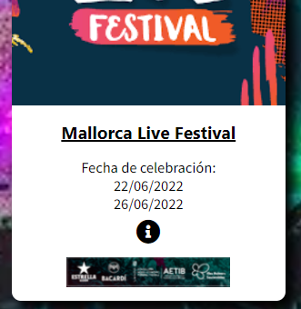
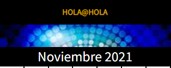
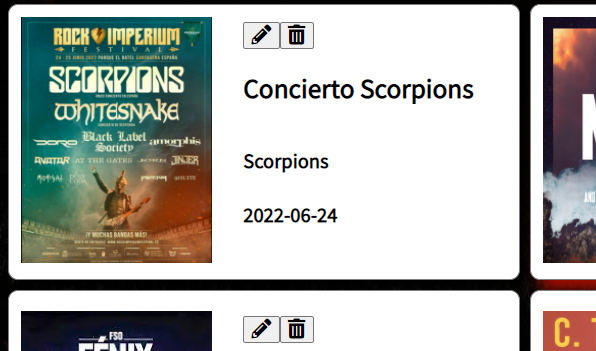

# TimeInn API (Pc4)

Se trata de una práctica para la asignatura de DWEC en la cual reutilizamos la página de eventos que hicimos, pero ahora todas las noticias y eventos se muestran gracias al fetch, en este caso hacia una fake-api.

## Cómo utilizarlo

<b>Actualización:</b> Hay que descargar también [estos archivos json](https://drive.google.com/drive/folders/113RZub3vipYQYI-ST3lOvb-cL2ifPG_S?usp=sharing), sobretodo el crud.json que es el que contiene los eventos, ya que si no, no se podrán visualiza en la página de inicio.

Hay que ejecutar los comandos para abrir dos servidores de fake-api: [este](https://github.com/typicode/json-server) y [este](https://github.com/classicoman2/fake-api-jwt-json-server). Uno es para el CRUD de los conciertos y el otro para el apartado de autenticación. En mi caso, guardo todos los datos en carpetas apartadas que se llaman api y api-auth. Ejecuto el primer servidor con el comando ```npm run api-crud```, y el segundo con ```npm run dev```. Hay que asegurarse de ejecutar estos comandos en la carpeta correcta, ya que se comprueban los script de los package.json de cada carpeta. El localhost para ver la página en sí se puede abrir con una extensión como Live Server.

## Funcionalidades

### Página principal
<p></p>

- En la página principal hay eventos y noticias, simplemente se recuperan desde los datos almacenados en la fake-api y se muestran en la página.
- Para entrar a los formularios desde la página principal hay que dar clic al icono de la persona, a la derecha del header.
- Cuando se hace un login correcto, se redirige al usuario a la página de inicio y encima del calendario se muestra el email del usuario que está logueado, ya que este se queda guardado en una cookie.

<p></p>

### Página de eventos(conciertos)
<p></p>

- Es un CRUD de conciertos. Justo debajo del header están algunos de los botones para interactuar con ellos. El primero es el que permite añadir un concierto, que muestra un formulario y se guardará un concierto con la información escrita en los campos. No está programado para aceptar imágenes, así que introduce una por defecto.
- Cuando hay conciertos añadidos, se muestran en pantalla. Estos conciertos tienen los botones de editar y eliminar.
- Editar permite cambiar los datos de ese concierto, mostrando un formulario para volver a introducir sus datos y guardando lo que haya en los campos.
- Eliminar permite borrar el concierto al que ese botón va ligado.

### Login y registro

- Son dos formularios que solicitan email y contraseña. A diferencia de las prácticas anteriores, cuando registras un usuario, se guarda realmente en la fake-api tanto su email como su contraseña.
- Solo permite hacer login cuando ambas credenciales coinciden con las que están guardades en el archivo users.json de la fake-api. El email con el que se hace login es el que se envía a la cookie y se muestra en la página de inicio.
- No existe una validación para controlar cómo es el formato de los email y las contraseñas, simplemente deja que se registren.
